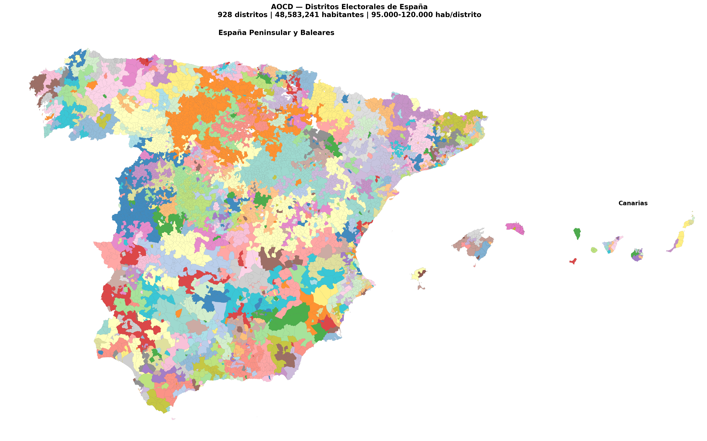

# 🏛️ La Constitución Democrática 🏛️

**Un sistema político aplicable a cualquier nación.**

La tendencia a concentrar poder, corromper instituciones y capturar mecanismos de control no es cosa de un país ni de una época. Son constantes humanas. Si el problema es universal, la solución también puede serlo.

Esta constitución de 72 artículos es un intento de respuesta: un marco capaz de adaptarse a cualquier cultura e historia, diseñado con mentalidad de hacker — no "¿funcionará si todos cooperan?" sino "¿cómo romperías el sistema?".

La base teórica viene de Antonio García Trevijano: distritos uninominales, doble vuelta, revocabilidad directa y autodestrucción mutua entre poderes. La premisa viene de Robert Michels y su Ley de Hierro de las Oligarquías: toda organización tiende a concentrar el poder, por ello aquí se diseña explícitamente contra eso. La ingeniería viene de los sistemas distribuidos y la tolerancia a fallos bizantinos, fruto de la experiencia profesional del autor en blockchain. Y la redacción — sin ambigüedades, sin redundancias, sin loopholes — sigue los principios de desarrollar software mantenible y resiliente: cada artículo tiene una sola responsabilidad, cada definición existe en un solo lugar, y cada excepción es explícita.

Y la filosofía de fondo es simple: no se asume buena voluntad — se asume el peor caso y se diseña para que el coste de romper el sistema sea prohibitivo a no ser que provenga racionalmente desde el mismo demos (pueblo).

Este texto ha pasado por un proceso de revisión exhaustivo: cada artículo ha sido analizado bajo la mentalidad de un atacante con recursos ilimitados, buscando ambigüedades, inconsistencias y formas de romper el sistema. Aun así, ningún sistema es perfecto. Si encuentras un fallo, una mejora o algo que no encaja, abre un issue en este repositorio o contacta al autor.

## 🇪🇸 Leer el libro

- [Leer online (Markdown)](obra-constitucion-democratica/partes/es/la-constitucion-democratica.md)
- [Descargar PDF](obra-constitucion-democratica/partes/es/la-constitucion-democratica.pdf)

🗺️ Primer boceto: Distritos electorales de España según el AOCD

Primera iteración del Algoritmo de Optimización de la Corruptibilidad de Distritos aplicado a datos reales de España (INE 2024). Boceto inicial con limitaciones conocidas — [ver análisis completo](aocd/README.md).

**Autor:** Carlos D. Alegre Urquizú

## 🇬🇧 English version

- [Read online (Markdown)](obra-constitucion-democratica/partes/en/the-democratic-constitution.md)
- [Download PDF](obra-constitucion-democratica/partes/en/the-democratic-constitution.pdf)

> ⚠️ **Warning:** This English version has been translated by AI. In case of any inconsistency or ambiguity, the [Spanish version](obra-constitucion-democratica/partes/es/la-constitucion-democratica.md) is the authoritative source of truth.

  

